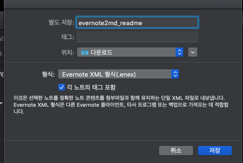
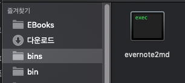

# evernote2md

evernote를 md파일로 변경하는 방법에 대하여 개인적인 팁

evernote2md 를 받는다. 

이분의 github에 소스 코드 및 릴리즈 버전이 있다. 돈받고 팔아도 되겠는데... 역시 오픈소스 만만세

[https://github.com/wormi4ok/evernote2md/releases/tag/v0.9.0](https://github.com/wormi4ok/evernote2md/releases/tag/v0.9.0)

---

**개인적 사용 셋팅**

* 노트북

* 노트북에는 항상 readme.md 용의 프로젝트 readme 노트를 꼭 준비한다.

해당 노트는 github용으로 사용하기에 필요한 정보를 프로젝트의 목표에 맞춰서 작성

개인적으로 bash_profile

* evernote2md를 실행 타겟은 방금 추출한 내역

%!(EXTRA markdown.ResourceType=, string=, string=)

이제 올리면 된다.
